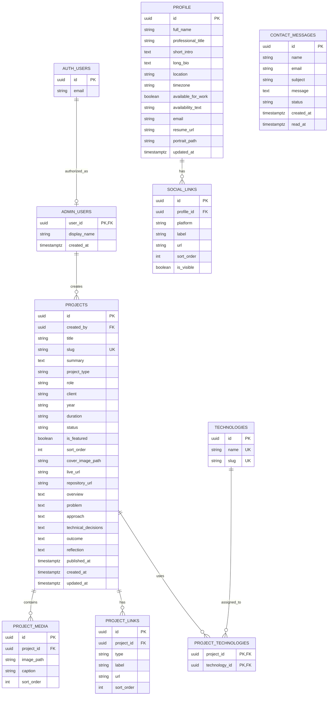

# 03 — Database ERD

## Entity Relationship Diagram



`AUTH_USERS` is Supabase's internal `auth.users` table, not a table we create.

## Status Enums

### Project status

```text
draft
published
archived
```

Only `published` projects are readable by visitors.

### Contact message status

```text
unread
read
archived
spam
```

## Row Level Security

RLS is enabled on all public tables.

### Public access

- Read `PROFILE`.
- Read `SOCIAL_LINKS` only where `is_visible = true`.
- Read `PROJECTS` only where `status = 'published'`.
- Read technologies, links, and media belonging to published projects.
- No read access to `CONTACT_MESSAGES`.
- No read access to the admin list.

### Admin access

- Only users present in `ADMIN_USERS`.
- Create and update all content.
- Read and update message status.
- Admin operations are still verified server-side, not just protected at the UI level.

## Notes

- `PROFILE` is effectively a singleton row in practice, but normalized for future
  multi-admin support.
- `is_featured` and `sort_order` control homepage display.
- A single admin is expected at launch; the schema supports more without change.
