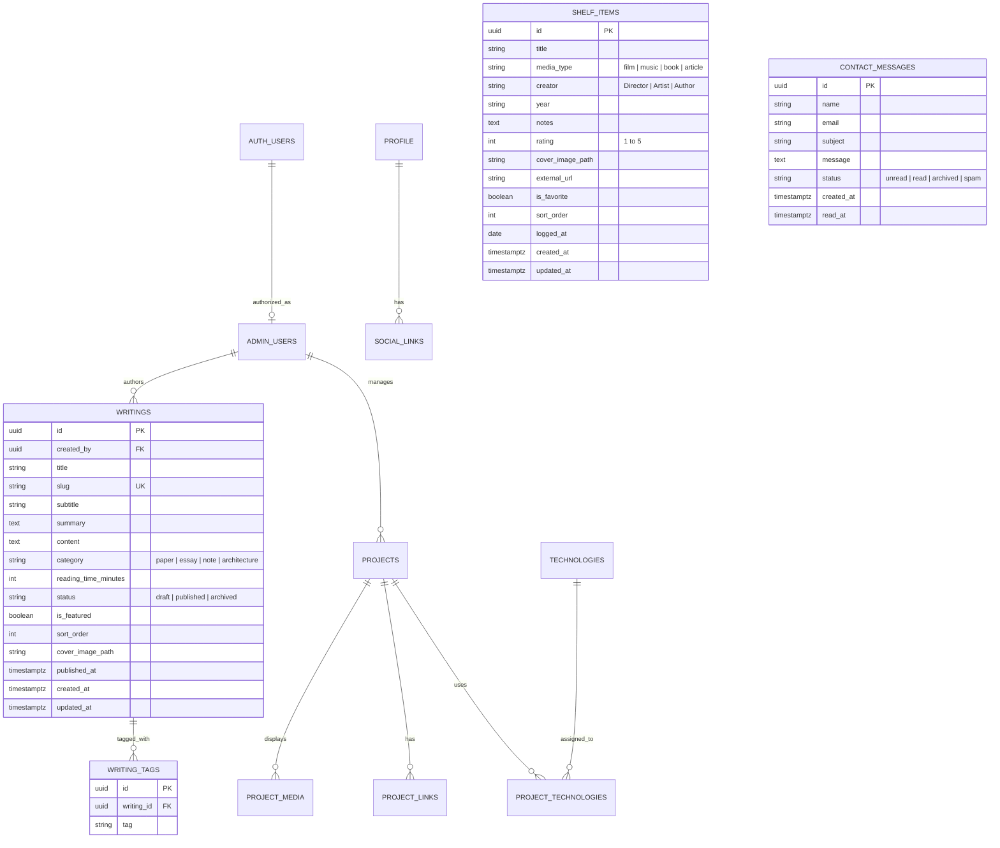

# 08 — Backend Architecture & Scalable Multi-Disciplinary Model

## 1. Overview & Vision

The backend architecture is engineered as a **resilient, serverless personal monograph system**. Rather than a static, one-dimensional portfolio, the platform operates as a multi-disciplinary archive balancing three distinct content pillars:

```text
                                  ┌────────────────────────┐
                                  │      VISITOR / UI      │
                                  └───────────┬────────────┘
                                              │
                                              ▼
                        ┌───────────────────────────────────────────┐
                        │           Next.js 16 (App Router)         │
                        │      Server Components & Route Handlers   │
                        └─────┬───────────────────────────────┬─────┘
                              │                               │
                              ▼                               ▼
               ┌──────────────────────────────┐ ┌──────────────────────────────┐
               │    Public Query Services     │ │     Admin Query Services     │
               │   (lib/queries/public.ts)    │ │    (lib/queries/admin.ts)    │
               └──────────────┬───────────────┘ └─────────────┬────────────────┘
                              │                               │
                    ┌─────────┴─────────┐                     │
         Online     │                   │ Offline/Prerender   │
         (Database) ▼                   ▼ (Fallback Data)     │
       ┌────────────────────────┐   ┌───────────────────────┐ │
       │  Supabase PostgreSQL   │   │  Local Curated Data   │ │
       │  (RLS Enabled, O(1))   │   │     (lib/data/*)      │ │
       └────────────────────────┘   └───────────────────────┘ │
                    ▲                                         │
                    └─────────────────────────────────────────┘
                               Authenticated CRUD
```

1. **Engineering Systems (`projects`)**: Deep-dive production case studies, Host-to-Host banking infrastructure, enterprise ERP architectures, technology stacks, and media specimens.
2. **Intellectual Writing (`writings`)**: Technical whitepapers, architectural monographs, engineering reflections, and short field notes.
3. **Cultural Shelf (`shelf_items`)**: Curated archive of cinema, vinyl/music albums, literature, and articles reflecting intellectual influence and personal taste.

---

## 2. Entity Relationship Diagram (ERD)



---

## 3. Database Schema & Indexing Strategy

### 3.1 `public.writings`
Stores all long-form textual thought leadership, architecture whitepapers, and essays.
- **Indexes**:
  - `idx_writings_slug`: Unique index on `slug` for $O(1)$ fast lookups during SSG / dynamic routing.
  - `idx_writings_status`: Filters `status = 'published'` for all public queries.
  - `idx_writings_category`: Accelerates category-specific filtering (`paper`, `essay`, `architecture`, `note`).

### 3.2 `public.writing_tags`
Relational tag mapping enabling topic discovery (e.g. `PostgreSQL`, `Distributed Systems`, `Accounting Systems`).
- **Indexes**:
  - `idx_writing_tags_tag`: Enables fast tag-based grouping across writings.

### 3.3 `public.shelf_items`
Stores the curated cultural archive (cinema, albums, books).
- **Indexes**:
  - `idx_shelf_media_type`: Fast filtration by media format.
  - `idx_shelf_favorite`: Rapid retrieval of favorite/highlighted entries.
  - `idx_shelf_sort`: Composite index on `(sort_order asc, logged_at desc)` for natural chronological sorting.

---

## 4. Security & Row Level Security (RLS)

All tables enforce strict Row Level Security:

| Table | Public Access (`anon`) | Admin Access (`authenticated`) |
|---|---|---|
| `profile` | Read-only | Full CRUD via `public.is_admin()` |
| `social_links` | Read-only where `is_visible = true` | Full CRUD |
| `projects` | Read-only where `status = 'published'` | Full CRUD |
| `project_media` | Read-only for published projects | Full CRUD |
| `project_links` | Read-only for published projects | Full CRUD |
| `writings` | Read-only where `status = 'published'` | Full CRUD |
| `writing_tags` | Read-only for published writings | Full CRUD |
| `shelf_items` | Read-only (All items) | Full CRUD |
| `contact_messages` | **None** (Inserts via Server Action with Service Role) | Read & update status |

---

## 5. Resilience Pattern: Zero-Crash Data Layer

The backend incorporates an essential resilience pattern to guarantee build stability and offline development capability.

### 5.1 Dual-Source Resolution
Every query in `lib/queries/public.ts` resolves in two phases:
1. **Live Supabase Resolution**: Attempts to query live PostgreSQL tables with RLS.
2. **Deterministic Fallback Resolution**: If Supabase environment variables are missing, the network is offline, or the database is unseeded, queries gracefully degrade to curated data from `lib/data/`:
   - `CURATED_PROJECTS` in `lib/data/curated-projects.ts`
   - `CURATED_WRITINGS` in `lib/data/curated-writings.ts`
   - `CURATED_SHELF` in `lib/data/curated-shelf.ts`
   - `DEFAULT_PROFILE` in `lib/data/profile-data.ts`

### 5.2 Build Invariant
Because Next.js runs static pre-rendering at build time (`generateStaticParams`), builds will **never crash** even in restricted build environments or without live API keys.

---

## 6. Service & Query API Contract

### 6.1 Public Queries (`lib/queries/public.ts`)
- **Projects**:
  - `getFeaturedProjects(): Promise<ProjectCard[]>`
  - `getPublishedProjectSlugs(): Promise<string[]>`
  - `getProjectBySlug(slug: string): Promise<ProjectDetail | null>`
  - `getAdjacentProjects(slug: string): Promise<{ previous, next }>`
- **Writings**:
  - `getFeaturedWritings(): Promise<WritingCard[]>`
  - `getAllPublishedWritings(category?: WritingCategory): Promise<WritingCard[]>`
  - `getPublishedWritingSlugs(): Promise<string[]>`
  - `getWritingBySlug(slug: string): Promise<Writing | null>`
- **Shelf**:
  - `getShelfItems(mediaType?: ShelfMediaType): Promise<ShelfItem[]>`
  - `getFavoriteShelfItems(): Promise<ShelfItem[]>`

### 6.2 Admin Queries (`lib/queries/admin.ts`)
- `getAllWritingsAdmin(): Promise<AdminWritingListItem[]>`
- `getAdminWritingById(id: string): Promise<Writing | null>`
- `getAllShelfItemsAdmin(): Promise<ShelfItem[]>`

---

## 7. Migration Execution Guide

To apply the latest schema changes to a live Supabase instance:
1. Open the **Supabase Dashboard** -> **SQL Editor**.
2. Execute [`supabase/migrations/20260916_expand_writings_and_shelf.sql`](file:///home/aloalfyan/personal-portfolio/supabase/migrations/20260916_expand_writings_and_shelf.sql).
3. Ensure storage bucket `portfolio-media` has public read access enabled for paths `writings/*` and `shelf/*`.
